# TradeWinds

TradeWinds是一个模拟中世纪地中海贸易网络的复杂经济模拟器。该项目重现了历史上著名贸易城市之间的商业活动，包括船只航行、货物交易、价格波动、货币系统以及随机事件，为用户提供了一个生动的历史贸易体验。

## 功能特点

- **多城市贸易网络**: 模拟里斯本、威尼斯、君士坦丁堡、亚历山大等7个历史贸易城市
- **动态价格系统**: 根据供需关系、城市特产和随机事件实时调整商品价格
- **船只贸易模拟**: 7艘贸易船只根据AI策略在城市间航行并进行交易
- **货币系统**: 完整的货币供应、通货膨胀和城市间汇率系统
- **随机事件**: 海盗袭击、暴风雨、疾病爆发等多种影响贸易的随机事件
- **商品质量系统**: 每种商品分为粗糙、普通、精良、极品四个质量等级
- **可视化分析**: 生成多种图表展示模拟结果，包括价格历史、船只资金、贸易路线等

## 模拟结果展示

### 城市价格历史

城市价格历史图展示了各个城市中主要商品价格随时间的变化，反映了供需波动和市场动态。

#### 里斯本价格历史
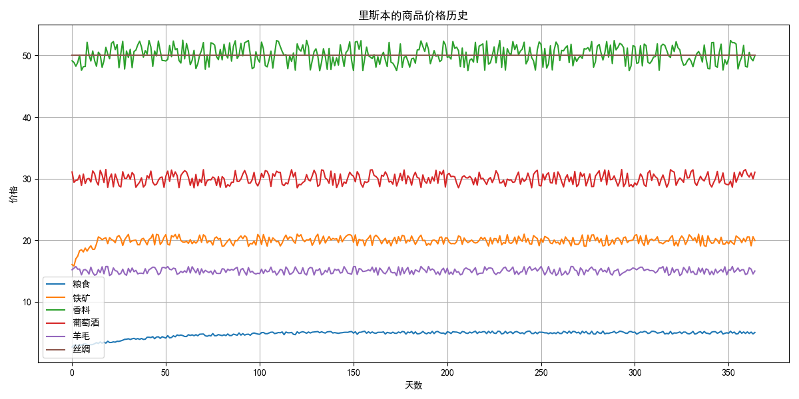

#### 威尼斯价格历史
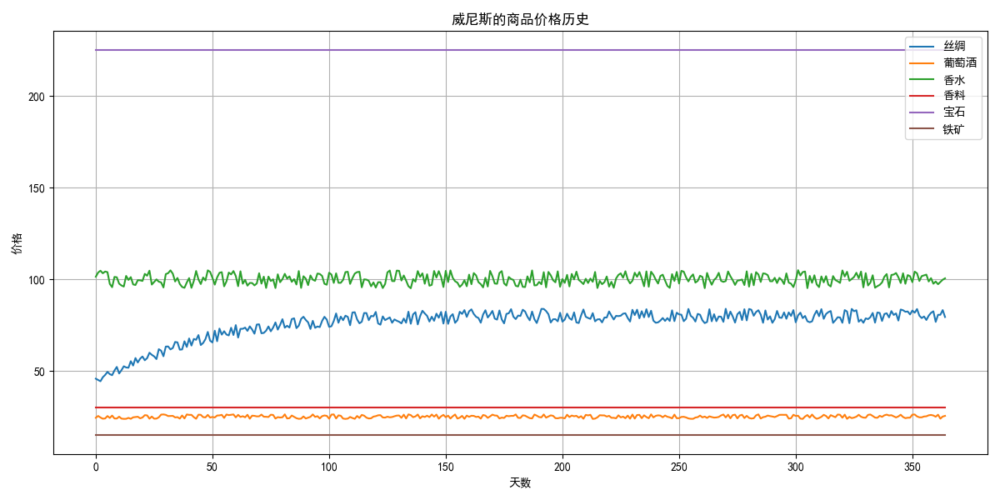

#### 君士坦丁堡价格历史
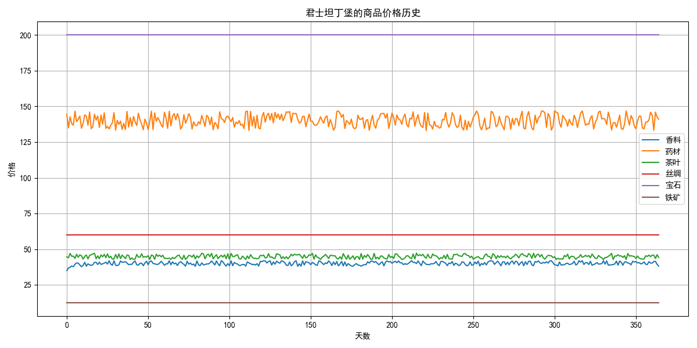

#### 亚历山大价格历史
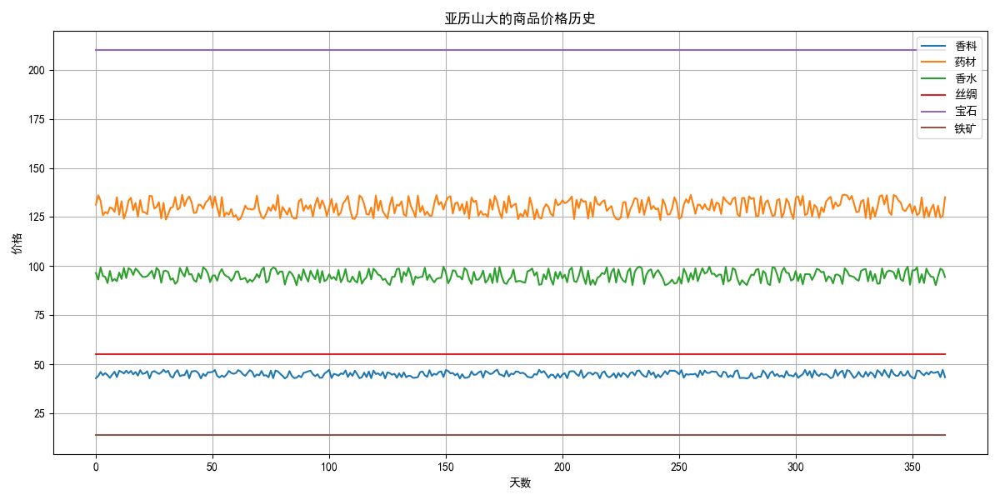

#### 热那亚价格历史
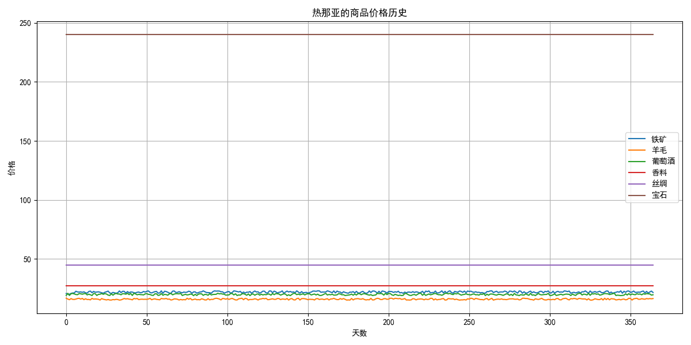

### 船只资金历史

这些图表展示了各船只的资金变化，反映了其贸易策略的成效和遭遇的各种事件（如海盗袭击）。

#### 海蛇号
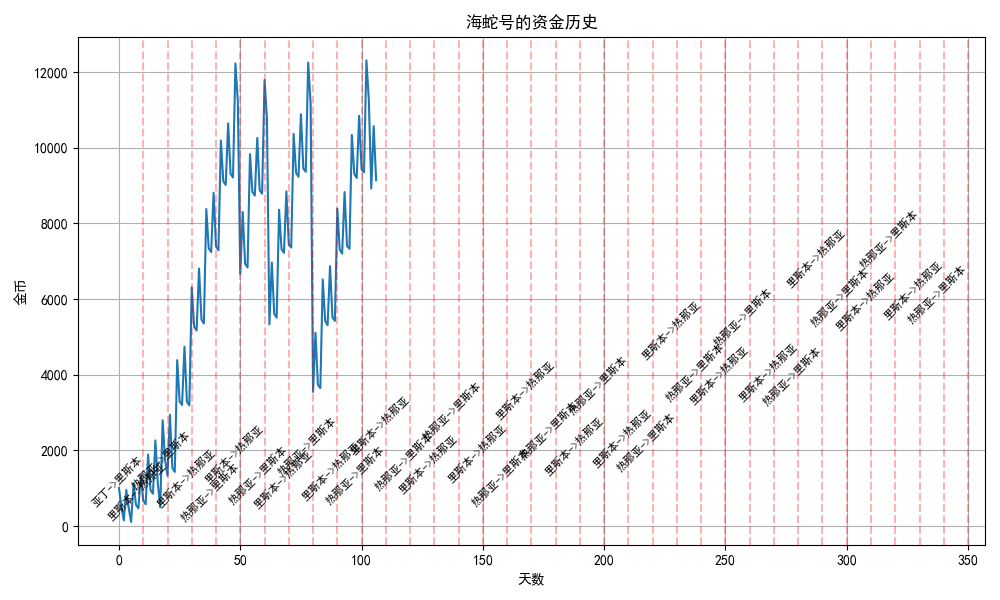

#### 海狮号
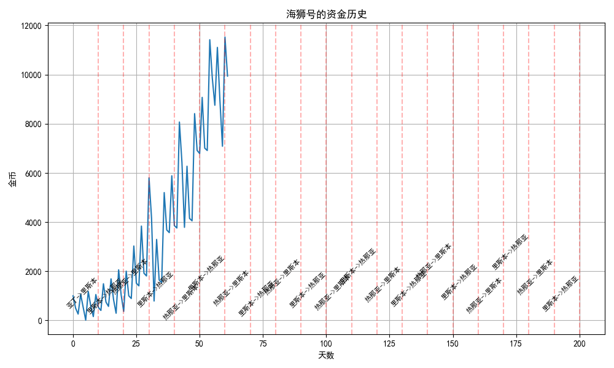

#### 黄金鹿号
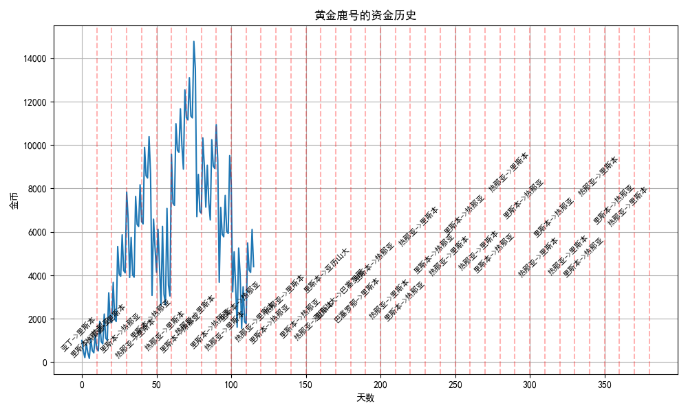

#### 北极星号
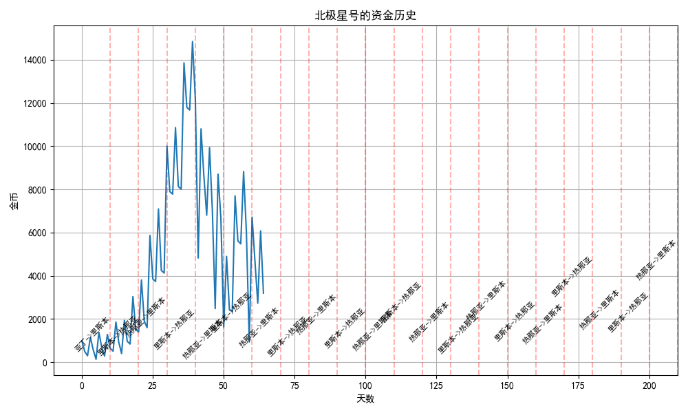

#### 龙骑士号
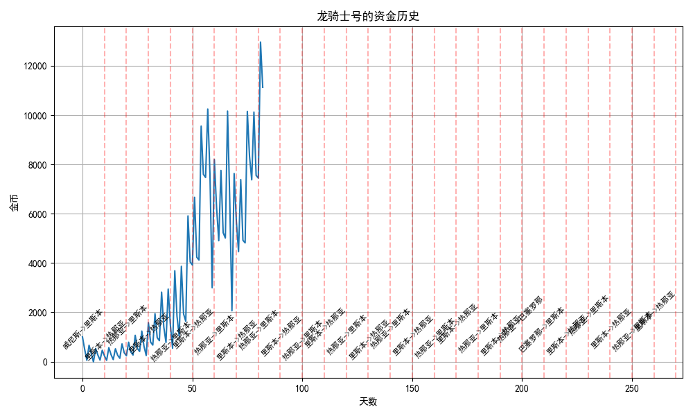

#### 风暴使者号
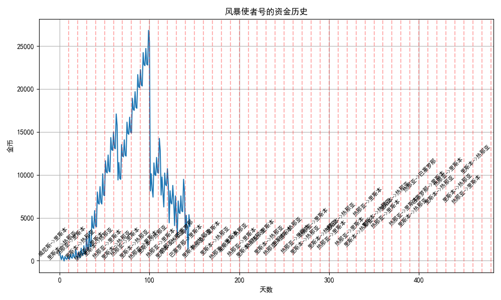

#### 宝藏号
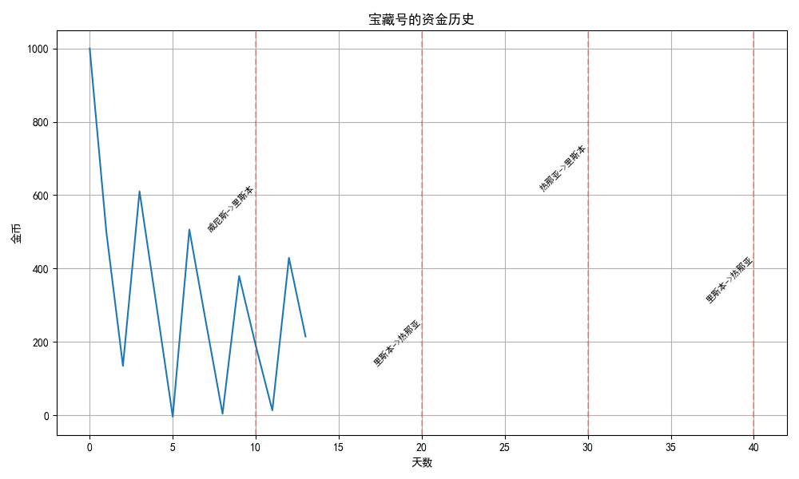

### 贸易地图

贸易地图展示了城市间的贸易路线、距离以及海况状态，不同的线条颜色和样式代表不同的海况和危险程度。

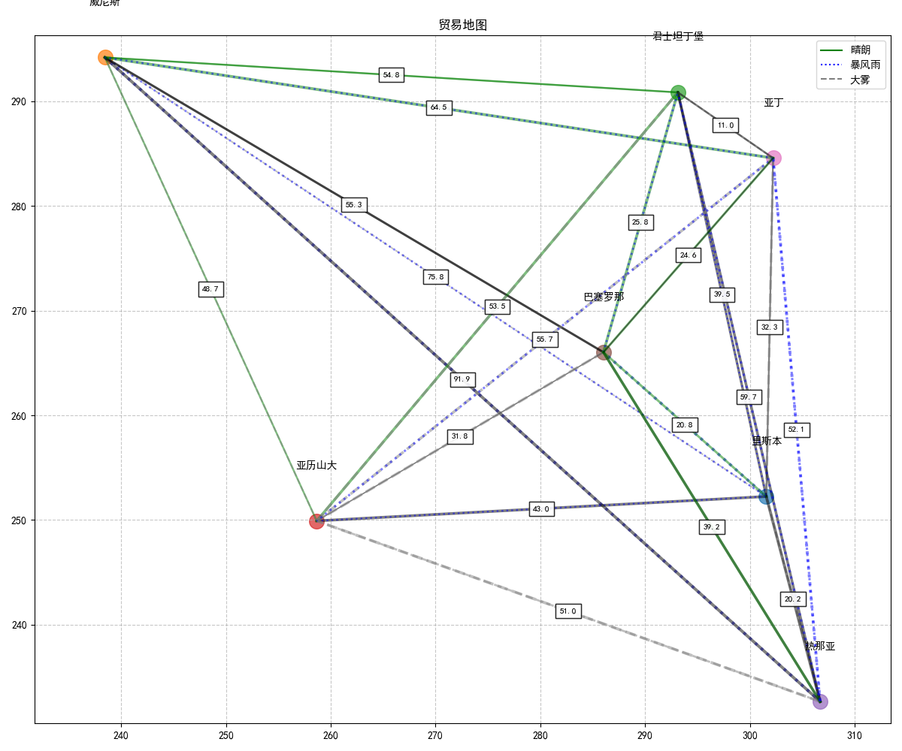

### 货币系统

货币系统图表展示了整个模拟期间的货币供应量、通货膨胀率以及各城市货币价值的变化。

#### 货币供应量历史
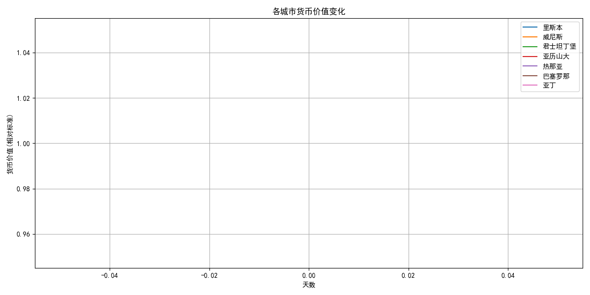

#### 全局通货膨胀率历史
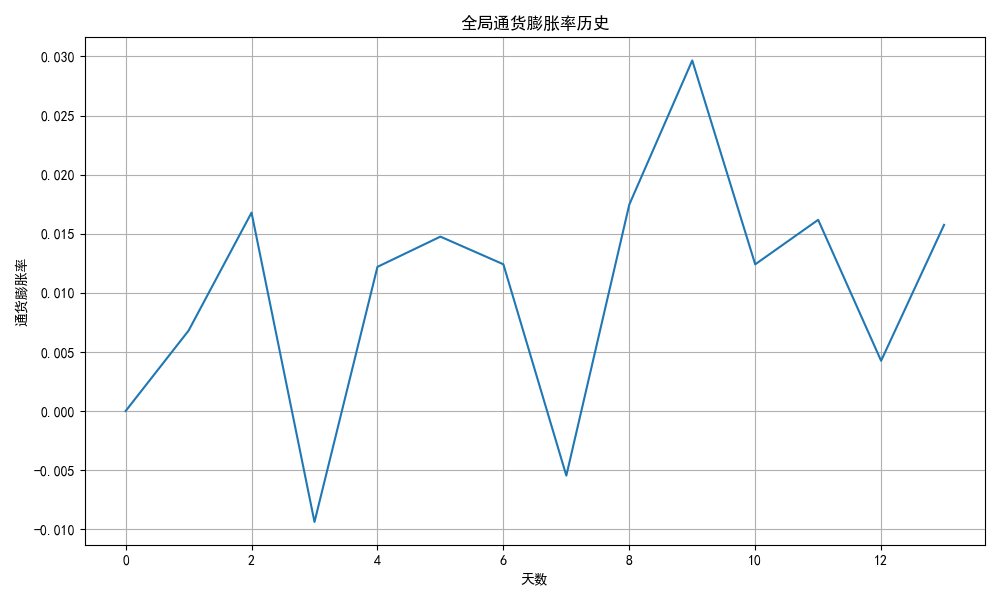

#### 各城市货币价值变化
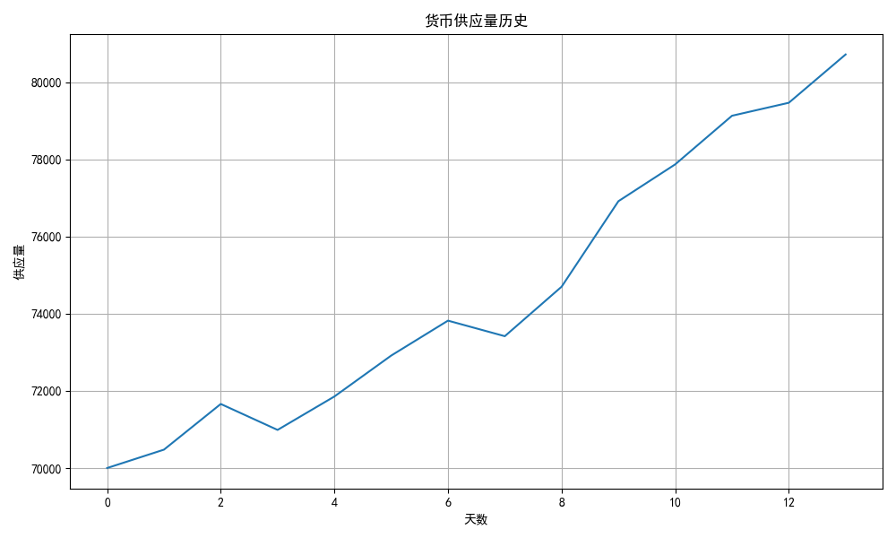

## 使用说明

1. 确保安装了Python 3.7+和所需依赖库（matplotlib, numpy等）
2. 克隆本仓库到本地
3. 运行main.py文件启动模拟：`python main.py`
4. 模拟结果将打印在控制台，并生成各类图表保存在outputs/images目录下

## 核心概念

### 城市

每个城市都有以下特性：
- **特产商品**：每个城市有2-3种特产，价格更低，数量更多
- **基础价格**：每种商品在该城市的基础价格
- **库存**：不同商品的当前库存量
- **货币**：每个城市有自己的货币和汇率

### 船只

船只是贸易的主要执行者，具有以下特性：
- **容量**：决定船只能够携带的最大商品数量
- **速度**：决定船只在贸易路线上的行进速度
- **资金**：用于购买商品的金币
- **贸易策略**：AI控制的贸易决策逻辑，决定购买和销售什么商品

### 货币系统

模拟器包含一个完整的货币系统：
- **货币供应量**：影响全局经济的货币总量
- **通货膨胀率**：反映商品价格的整体变化趋势
- **城市货币**：每个城市有自己的货币，城市间存在汇率关系

### 随机事件

模拟中会发生多种随机事件，影响经济和贸易：
- **海盗事件**：如海盗袭击、海盗围攻等，造成船只资金损失
- **天气事件**：如暴风雨、大雾等，影响船只航行速度
- **城市事件**：如疾病爆发、丰收、贸易封锁等，影响商品价格

### 商品质量系统

每种商品分为四个质量等级：
- **粗糙**：最低质量，价格最低
- **普通**：标准质量
- **精良**：高质量，价格较高
- **极品**：最高质量，价格最高

船只可以根据自己的偏好选择交易不同质量的商品。
